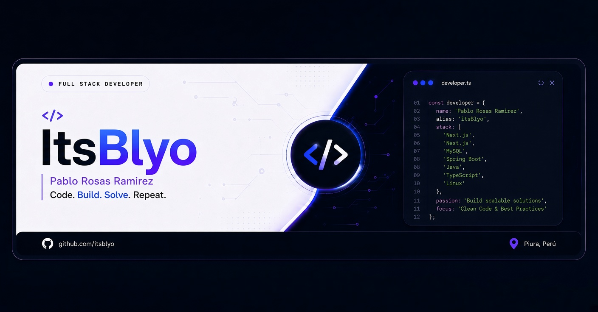

  

  

<!-- ===== JAPONÉS ARRIBA ===== -->

  

<!-- ===== INGLÉS DEBAJO ===== -->

  

  

    
    
    
  

 

## Languages and Tools

> Tools and technologies that I have worked with and am interested in.

<table>
  <tr>
    <td align="center" width="96">
      
       Spring
    </td>
    <td align="center" width="96">
      
       Java
    </td>
    <td align="center" width="96">
      
       REST API
    </td>
    <td align="center" width="96">
      
       PostgreSQL
    </td>
    <td align="center" width="96">
      
       Git
    </td>
    <td align="center" width="96">
      
       GitHub
    </td>
    <td align="center" width="96">
      
       Docker
    </td>
    <td align="center" width="96">
      
       Postman
    </td>
    <td align="center" width="96">
      
       Linux
    </td>
  </tr>
  <tr>
    <td align="center" width="96">
      
       JavaScript
    </td>
    <td align="center" width="96">
      
       HTML
    </td>
    <td align="center" width="96">
      
       CSS
    </td>
    <td align="center" width="96">
      
       Bootstrap
    </td>
    <td align="center" width="96">
      
       React
    </td>
    <td align="center" width="96">
      
       Node.js
    </td>
    <td align="center" width="96">
      
       MySQL
    </td>
    <td align="center" width="96">
      
       NPM
    </td>
    <td align="center" width="96">
      
       Markdown
    </td>
  </tr>
  <tr>
    <td align="center" width="96">
      
       WordPress
    </td>
    <td align="center" width="96">
      
       VSCode
    </td>
    <td align="center" width="96">
      
       Figma
    </td>
    <td align="center" width="96">
      
       Canva
    </td>
    <td align="center" width="96">
      
       Trello
    </td>
  </tr>
</table>

 

## About Me

 

  

  
  
  

  
  
  

 

Hi, I'm **Pablo Aldair Rosas Ramirez**, a passionate **Java Backend Developer** with expertise in **Spring Boot** and **REST APIs**. I specialize in creating scalable, secure, and high-performance applications that drive business solutions.

 

## Contribution Snake

 

<picture>
  <source media="(prefers-color-scheme: dark)" srcset="https://raw.githubusercontent.com/itsblyo/itsblyo/output/github-snake-dark.svg" />
  <source media="(prefers-color-scheme: light)" srcset="https://raw.githubusercontent.com/itsblyo/itsblyo/output/github-snake.svg" />
  
</picture>

## GitHub Stats

  

    
  

  

    
  

